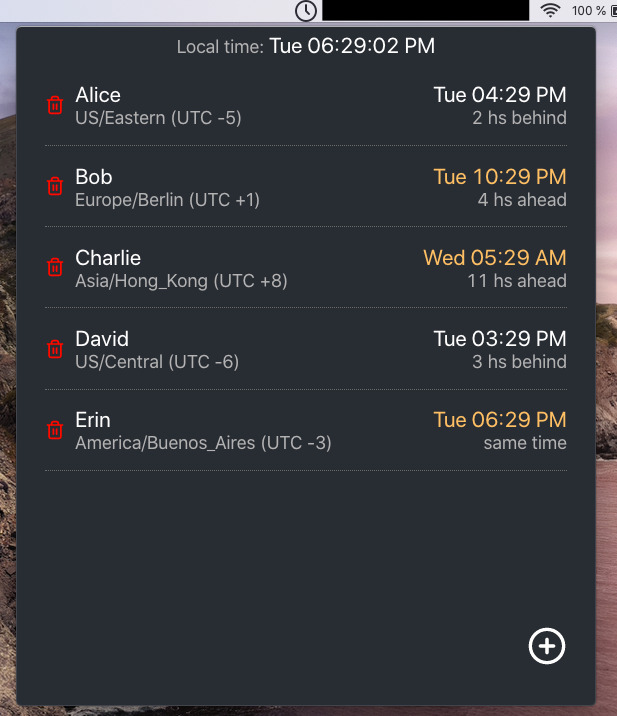
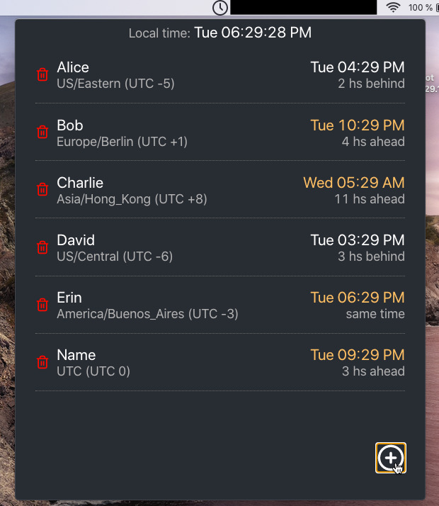
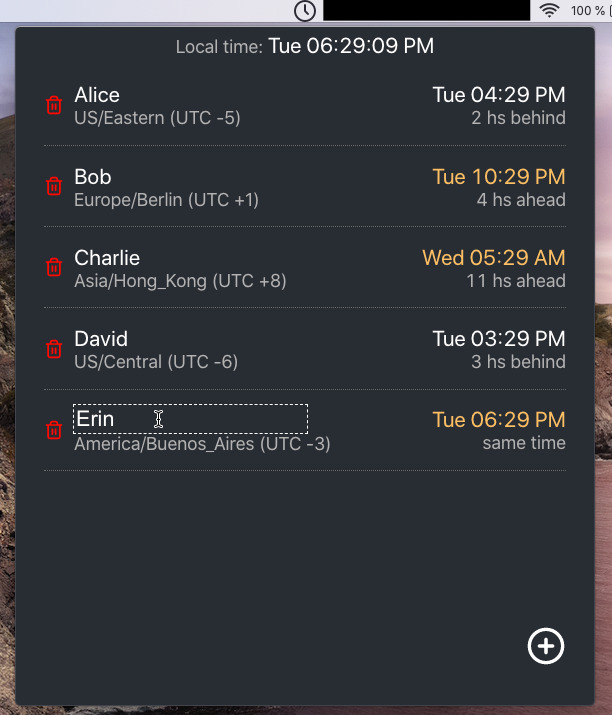
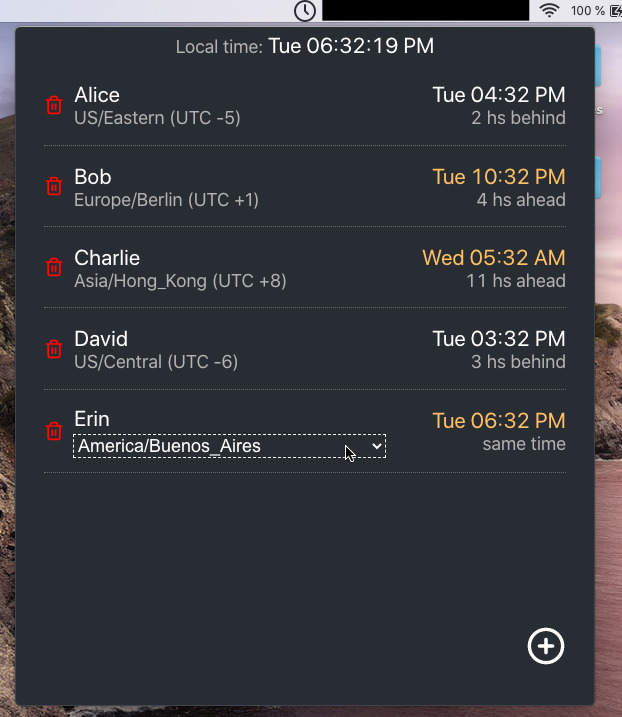

# When are you?
An application that lives on your tray and shows you 'when' people is.

## Disclaimer

Things may break.

This is a pet project and I've just spent the least amount of time on it to
learn solve my problem and learn some technologies along the way.

I've tried this out on Mac OS Catalina and Kubuntu Linux 20.04.

There are release builds that are not signed on purpose, I didn't want to spend time/money there.

## Get the app

Get your build from the <a href="https://github.com/ivanalejandro0/when-are-you/releases">releases page</a>.


## About the app

### How does it look like?



### Adding a new person



### Click the name to edit



### Click the timezone to edit



### Select a timezone from the dropdown


## For a developer

Check out the configured Github Actions for a working example on how to build the app.

### Run app from code

```
# to install dependencies, just required the first time
yarn

# to run the app
yarn start
```


### Building the app locally

```
# to install dependencies, just required the first time
yarn

# to package the app
yarn package
```
